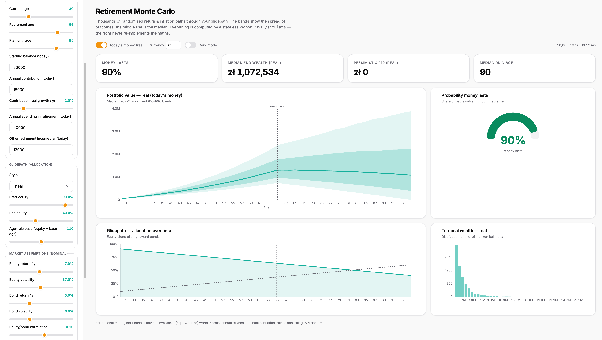
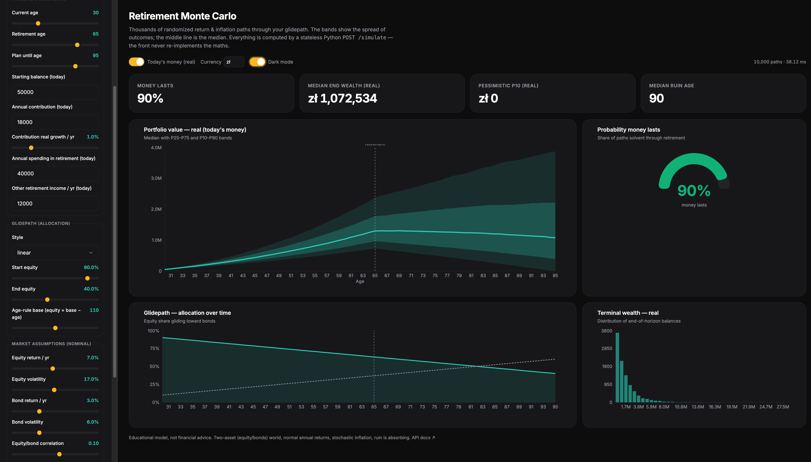

# glidepath

A small, honest **Monte Carlo retirement simulator**. Thousands of randomized
return / inflation paths run through an equity **glidepath** (the allocation that
*glides* from stocks toward bonds as you approach and enter retirement), so you
can see the spread of outcomes — not a single false-precision number.

It is deliberately **generic and open-source-safe**: a two-asset world, plain
assumptions, no account-specific or tax tooling. Wire it to your own ETF / IKZE
numbers without touching anything proprietary.

```
┌──────────────┐     ┌──────────────┐     ┌─────────────────┐
│ packages/core│ ──▶ │  apps/sim    │     │  apps/api (P2)  │
│  numpy engine│     │  Streamlit   │     │  FastAPI        │
│  (the truth) │ ──▶ │  + Plotly    │     │  POST /simulate │ ──▶ apps/web (P2)
└──────────────┘     └──────────────┘     └─────────────────┘     React+Recharts
       ▲
       └── notebooks/demo.ipynb
```

The **core engine is the single source of truth**. Everything else is a thin
presentation layer over it — so the simulation logic is written and tested once,
then reused by the Streamlit demo today and (Phase 2) a FastAPI service + React
front and a CLI rebalancer.

## UI Preview

| Light Mode | Dark Mode |
| --- | --- |
|  |  |

## What it models

- **Two-asset** (equity / bonds) world with correlated nominal returns.
- **Glidepath** allocation: `linear`, `age_rule` (equity = base − age), `constant`, or fully `custom`.
- **Stochastic inflation** — inflates contributions/spending, deflates results to today's money.
- **Accumulation** (contributions with optional real growth) and **decumulation** (spending offset by other income, e.g. a state pension).
- **Sequence-of-returns risk**, which emerges naturally from path simulation. Ruin is absorbing.

Outputs: full nominal & real path arrays, percentile fan bands, probability the
money lasts, terminal-wealth distribution, and ruin-age distribution.

> Educational model — **not financial advice**.

## Project layout (uv workspace)

| Path             | What                                                            |
| ---------------- | -------------------------------------------------------------- |
| `packages/core`  | `glidepath-core` — the numpy engine + optional Plotly charts.  |
| `apps/sim`       | `glidepath-sim` — Streamlit interactive demo.                  |
| `notebooks`      | `demo.ipynb` — guided tour with charts.                        |
| `apps/api`       | _Phase 2_ — FastAPI `POST /simulate` (stateless, numpy).       |
| `apps/web`       | _Phase 2_ — React + Recharts client.                           |

## Quickstart

Requires [uv](https://docs.astral.sh/uv/).

```bash
# install everything (core + viz + streamlit + dev tools)
uv sync --all-packages --all-extras

# run the tests
uv run pytest

# launch the interactive simulator
uv run --package glidepath-sim streamlit run apps/sim/app.py

# open the notebook
uv run --with jupyterlab jupyter lab notebooks/demo.ipynb
```

### Run the full stack (Docker Compose)

```bash
docker compose up --build
```

| URL | What |
| -------------------------- | --------------------------------------- |
| `http://localhost` | React + Recharts front |
| `http://localhost/docs` | FastAPI interactive docs (Swagger UI) |
| `http://localhost/redoc` | ReDoc API reference |
| `http://localhost/simulate`| `POST /simulate` endpoint (proxied) |

The React app sends all API calls through the Nginx reverse proxy, so no CORS
configuration is needed in development or production.

### Run the API only

```bash
uv run --package glidepath-api uvicorn glidepath_api.main:app --reload
# then open http://localhost:8000/docs
```

### Use the core directly

```python
from glidepath import simulate, summarize, SimulationParams, Glidepath

result = simulate(SimulationParams(
    start_age=30, retirement_age=65, end_age=95,
    annual_contribution=18_000, annual_spending=40_000,
    glidepath=Glidepath(style="linear", start_equity=0.90, end_equity=0.40),
))
print(summarize(result))   # success probability, median/P10/P90 terminal wealth, ruin age
```

## Why Python under the hood (and React later)

Retirement Monte Carlo is computationally trivial — 10k paths × 65 years is
~30 ms in numpy. So the Python core isn't here for *speed*; it's here for
**code reuse and clean layering**: one tested engine feeding a Streamlit app and
(Phase 2) a FastAPI service that a React + Recharts front consumes via a single
stateless `POST /simulate`. Same maths everywhere, written once.

## Roadmap

- **Phase 1 (done):** core engine + tests, Streamlit + Plotly demo, notebook.
- **Phase 2 (done):** FastAPI `POST /simulate`, React + Recharts front, Docker Compose, presets & scenario comparison.
- **Later:** historical block-bootstrap returns, multi-asset, tax-account wrappers (kept generic).

## License

MIT.
